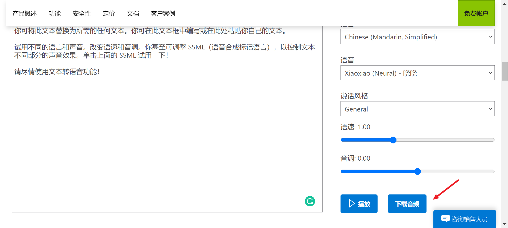
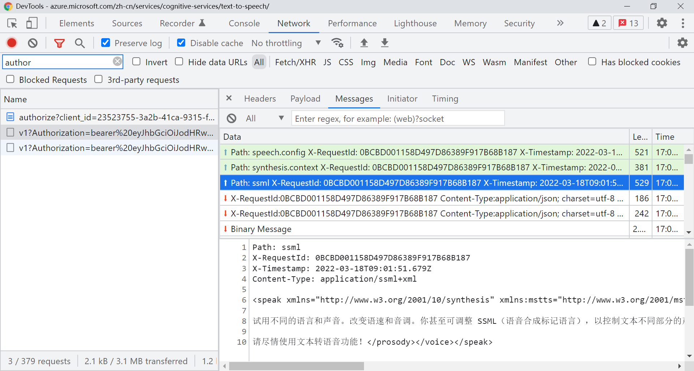
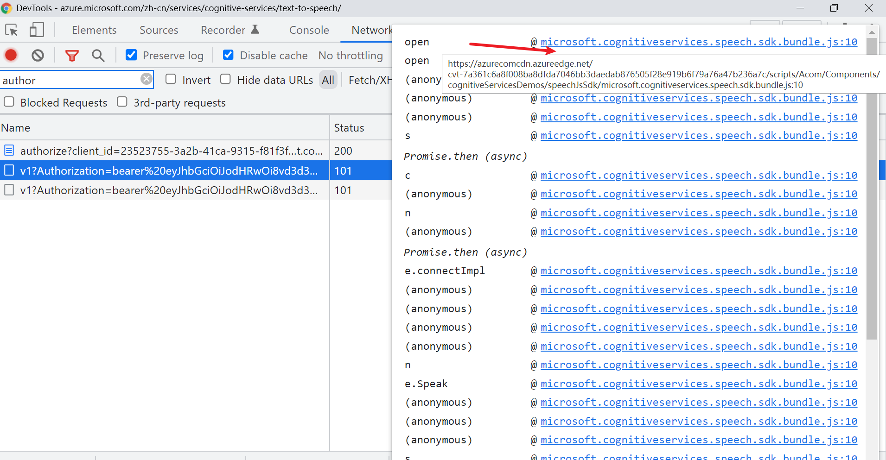
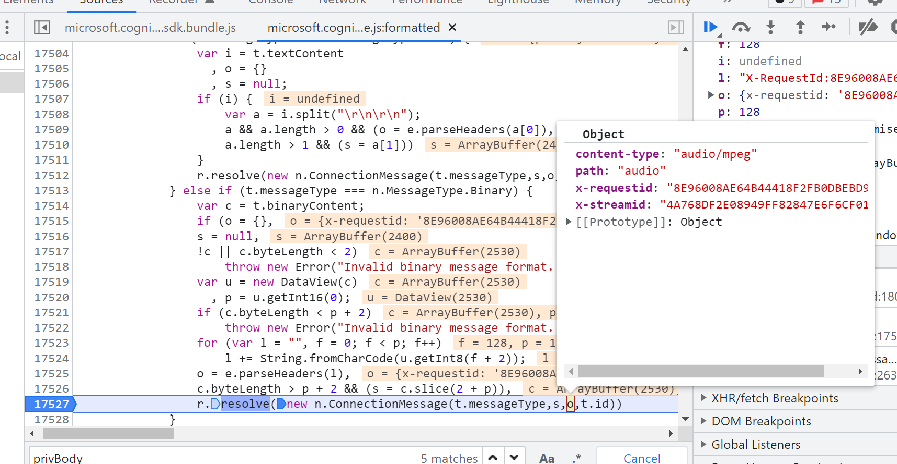
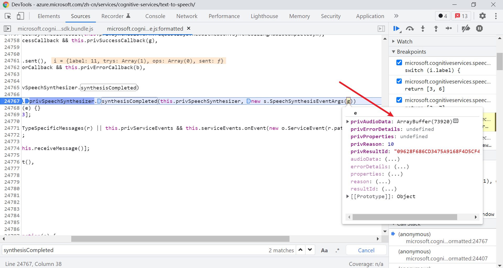
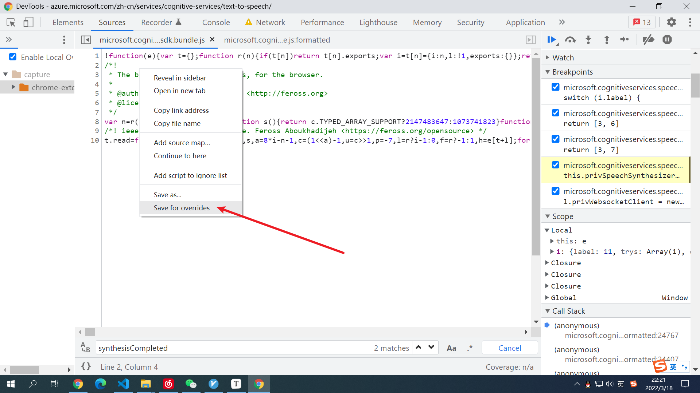
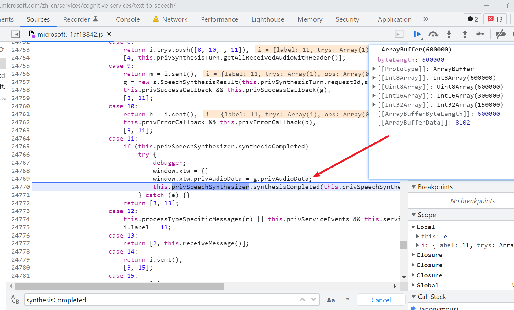
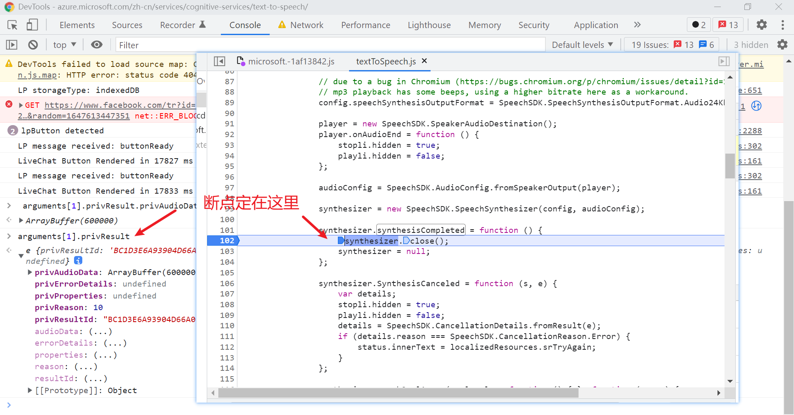
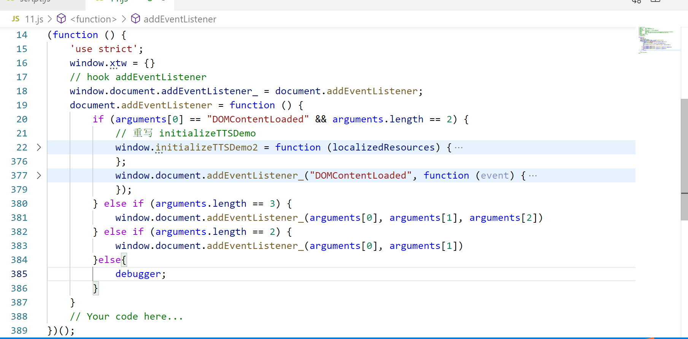

# 微软tts 下载音频按钮（tampermonkey脚本）的实现思路

**目标网站**

```
https://azure.microsoft.com/zh-cn/services/cognitive-services/text-to-speech/#features
```


- 目的是解决微软官方的网页版demo，不能直接下载转换后的MP3文件

**效果**




## 适合阅读的人群

- 有一定的JS逆向基础的人群
  - 会使用chrome开发者工具进行抓包调试和断点调试

- 如果只是想要实现`微软tts 下载音频`可以直接安装tampermonkey扩展后安装脚本即可,安装完成后会在声音合成后出现`下载音频`的按钮，脚本地址`https://greasyfork.org/zh-CN/scripts/441531-%E5%BE%AE%E8%BD%AFtts-%E4%B8%8B%E8%BD%BD%E6%8C%89%E9%92%AE`

## 理解本篇教程你将会对以下知识点有更深刻的理解

1. tampermokey 脚本的注入时机，需要尽可能早的注入时使用`@run-at document-start`
2. hook 的简单使用
3. 函数或变量的导出，比如导出到`window`方便后续使用，JS扣代码常用
4. 使用tampermokey 脚本 下载二进制文件的方法
5. websocket的简单了解


## 0x01

首先在目标网站`https://azure.microsoft.com/zh-cn/services/cognitive-services/text-to-speech/#features`点击几次`播放`抓几次包发现以下的请求是用来传输合成的音频的

```
wss://eastus.tts.speech.microsoft.com/cognitiveservices/websocket/v1?Authorization=bearer%20eyJhbGciOiJodHRwOi8vd3d3LnczLm9yZy8yMDAxLzA0L3htbGRzaWctbW9yZSNobWFjLXNoYTI1NiIsInR5cCI6IkpXVCJ9.eyJyZWdpb24iOiJlYXN0dXMiLCJzdWJzY3JpcHRpb24taWQiOiI2MWIxODBlMmJkOGU0YWI2OGNiNmQxN2UxOWE5NjAwMiIsInByb2R1Y3QtaWQiOiJTcGVlY2hTZXJ2aWNlcy5TMCIsImNvZ25pdGl2ZS1zZXJ2aWNlcy1lbmRwb2ludCI6Imh0dHBzOi8vYXBpLmNvZ25pdGl2ZS5taWNyb3NvZnQuY29tL2ludGVybmFsL3YxLjAvIiwiYXp1cmUtcmVzb3VyY2UtaWQiOiIvc3Vic2NyaXB0aW9ucy9jMjU1ZGYzNi05NzRjLTQ2MGEtODMwYi0yNTE2NTEzYWNlYjIvcmVzb3VyY2VHcm91cHMvY3MtY29nbml0aXZlc2VydmljZXMtcHJvZC13dXMyL3Byb3ZpZGVycy9NaWNyb3NvZnQuQ29nbml0aXZlU2VydmljZXMvYWNjb3VudHMvYWNvbS1zcGVlY2gtcHJvZC1lYXN0dXMiLCJzY29wZSI6InNwZWVjaHNlcnZpY2VzIiwiYXVkIjoidXJuOm1zLnNwZWVjaHNlcnZpY2VzLmVhc3R1cyIsImV4cCI6MTY0NzU5NDk1MCwiaXNzIjoidXJuOm1zLmNvZ25pdGl2ZXNlcnZpY2VzIn0.PjYuGtrhh9RgkaH3iPYwPxBwtUDaWCjIBT_iQbPJf7g&X-ConnectionId=F4D719576F88485997E628643E905B76
```

有两个参数`Authorization`和`X-ConnectionId`前者在网页的源码中，后者是`uuid4`，因为我们用tampermonkey脚本所以不需要搞定这两个参数的生成


这个还是`get`请求，但该请求后改变传输协议为`websockets`,发送需要转换的文本后，服务器返回了一堆`Binary Message`（二进制消息），这些就是合成的声音。




## 0x02

因为网页版会对合成的声音进行播放，所以前端肯定有对这些数据进行处理，我们只需要拿到前端处理完成的二进制文件就可以了。那问题就是处理后的二进制文件存哪里了？

可以进行简单的断点调试，没有思路就直接这个进去下一个断点，一步步往上找找看。




在这里可找到websocket的onmessage


这里`l.provWebsocketClient`Websocket的一个实例


继续往上追一层找到了每一次处理Binary消息的地方。




## 0x03

但是这么找很难找到最后binary传输完成后的完整音频数据。

这里再换一个方法，可以看到websocket通讯的最后有一个含有`Path:turn.end`的包，尝试在上面同一个js文件中搜一下 `turn.end`然后下断点。


可以发现定到了这里


这里好多case 一开始以为是控制流平坦化，但并不是，而且**变量名是有意义的**，稍微仔细一点就可以看到这样一个`synthesisCompleted`。


而且有一个if的判断，`synthesisCompleted`翻译过来是合成完成，打一个断点，确实是在websockets传输完成后会断住，里面的`g.privAudioData`猜测就是合成的mp3。




做一下实验，把这个二进制数据下载下载听一下，发现确实就是我们要的mp3

```
window.URL.createObjectURL(new Blob([g.privAudioData], { type: 'audio/mp3' }));
```


一开始我想到用chrome的overrides，（fiddler的autoresponse也可以做到）。



在把`g.privAudioData`导出到`window`这样就方便后面调用了



但是后面在下载的时候遇到了浏览器限制，并且这种替换线上文件的方法，对用户的配置要求较高。

## 0x04

我的目标是做一个装上就可以用的tampermonkey脚本。

为了拿到g.privAudioData 我在当前的作用域中找找看有没有生命周期比较长的比如`JSON`等之类的可以hook，发现并没有找到，但是我发现g是传进来的，于是找上一层，不行再找上一层。

最终我找到`document.addEventListener`，<u>这个注入点可能不是最好的，如果大佬有更好的欢迎指正。</u>

先说上面一层是




发现这里定义了一个匿名函数赋给了全局变量`window.initializeTTSDemo`,此处也没有找到合适的hook点，但是arguments[1].privResult 里面有我们要的MP3，我们要的东西没丢。

```javascript
'use strict';

(function ($) {
    // This demo is only supported in Edge, Firefox, Chrome and Opera. Source: http://caniuse.com/#search=getUserMedia

    window.initializeTTSDemo = function (localizedResources) {
        $(document).ready(function () {
			// 省略好多代码            

            SpeechSDK = window.SpeechSDK;

            // 省略好多代码
            function SpeakOnce() {
                var config = SpeechSDK.SpeechTranslationConfig.fromAuthorizationToken(localizedResources.token, localizedResources.region),
                    synthesizer,
                    audioConfig;

                // due to a bug in Chromium (https://bugs.chromium.org/p/chromium/issues/detail?id=1028206)
                // mp3 playback has some beeps, using a higher bitrate here as a workaround.
                config.speechSynthesisOutputFormat = SpeechSDK.SpeechSynthesisOutputFormat.Audio24Khz160KBitRateMonoMp3;

                player = new SpeechSDK.SpeakerAudioDestination();
                player.onAudioEnd = function () {
                    stopli.hidden = true;
                    playli.hidden = false;
                };

                audioConfig = SpeechSDK.AudioConfig.fromSpeakerOutput(player);

                synthesizer = new SpeechSDK.SpeechSynthesizer(config, audioConfig);

                synthesizer.synthesisCompleted = function () {
                    //arguments[1].privResult 里面有我们要的MP3
                    
                    synthesizer.close();
                    synthesizer = null;
                };

                synthesizer.SynthesisCanceled = function (s, e) {
                    var details;
                    stopli.hidden = true;
                    playli.hidden = false;
                    details = SpeechSDK.CancellationDetails.fromResult(e);
                    if (details.reason === SpeechSDK.CancellationReason.Error) {
                        status.innerText = localizedResources.srTryAgain;
                    }
                };

                synthesizer.speakSsmlAsync(ssml.value, function () { }, function (error) {
                    status.innerText = localizedResources.srTryAgain + ' ' + error;
                });
            }

           // 省略好多代码
})(jQuery);

```

我非常想重写`initializeTTSDemo`，但是失败了

在使用tampermonkey脚本 使用默认注入方式和改成了`@run-at document-start`都不能覆盖这个函数。

于是我继续找initializeTTSDemo执行的地方


最终还是找到了index.html 狗头

hook document.addEventListener 可以改写initializeTTSDemo



initializeTTSDemo中大部分都是抄的核心的修改如下：

```
synthesizer.synthesisCompleted = function () {
                            // 此时已经合成完毕了 arguments[1].privResult.privAudioData 为MP3文件
                            //debugger;
                            window.xtw.privAudioData = arguments[1].privResult.privAudioData;
                            window.xtw.playdlbut.innerHTML = "下载音频";
                            window.xtw.playdlbut.onclick = function () {
                                // https://stackoverflow.com/questions/19327749/javascript-blob-filename-without-link
                                function saveFile(name, type, data) {
                                    if (data !== null && navigator.msSaveBlob) {
                                        return navigator.msSaveBlob(new Blob([data], { type: type }), name);
                                    }
                                    var a = $("<a style='display: none;'/>");
                                    var url = window.URL.createObjectURL(new Blob([data], { type: type }));
                                    a.attr("href", url);
                                    a.attr("download", name);
                                    $("body").append(a);
                                    a[0].click();
                                    window.URL.revokeObjectURL(url);
                                    a.remove();
                                    window.xtw.playdlbut.innerHTML = "先点播放";
                                };
                                //debugger;
                                if (window.xtw.privAudioData) {
                                    saveFile(new Date().getTime(), "audio/mp3", window.xtw.privAudioData);
                                    window.xtw.privAudioData = null;
                                } else {
                                    alert('先点播放，等按钮变成下载音频再点击')
                                }
                            };
                            synthesizer.close();
                            synthesizer = null;
                        };
```

最后把按钮放在合适的位置，方便使用

```
if (!window.xtw.playdlbut) {
                        window.xtw.playdlbut = document.createElement("button");
                        window.xtw.playdlbut.innerHTML = "先点播放";
                        window.xtw.playdlbut.classList.add('button');
                        window.xtw.playdlbut.classList.add('button--primary01');
                        window.xtw.playdlbut.classList.add('svg-button');
                        window.xtw.li = document.createElement('li');
                        window.xtw.li.appendChild(window.xtw.playdlbut);
                        window.xtw.playliparent = document.getElementById('playli').parentElement
                        window.xtw.playliparent.appendChild(window.xtw.li);
                    }
```


## 完整的脚本代码

```
https://greasyfork.org/zh-CN/scripts/441531-%E5%BE%AE%E8%BD%AFtts-%E4%B8%8B%E8%BD%BD%E6%8C%89%E9%92%AE
```

