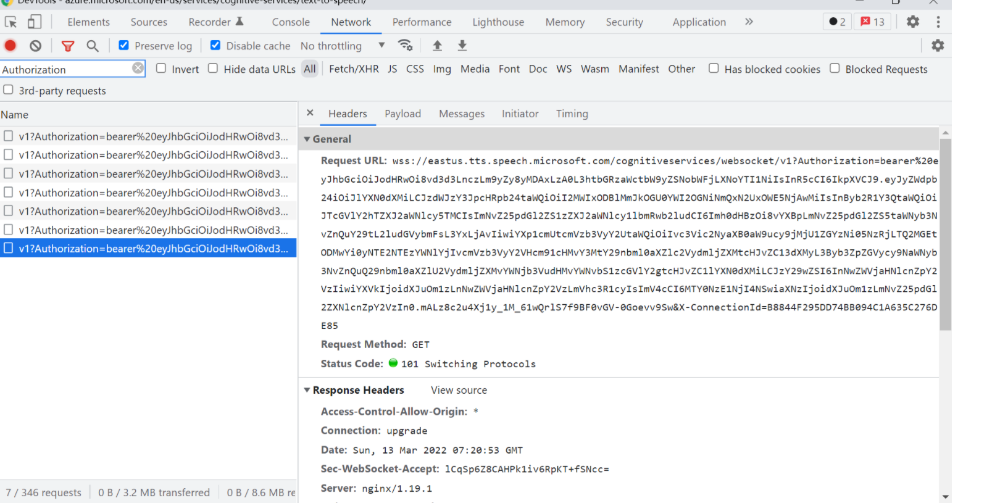
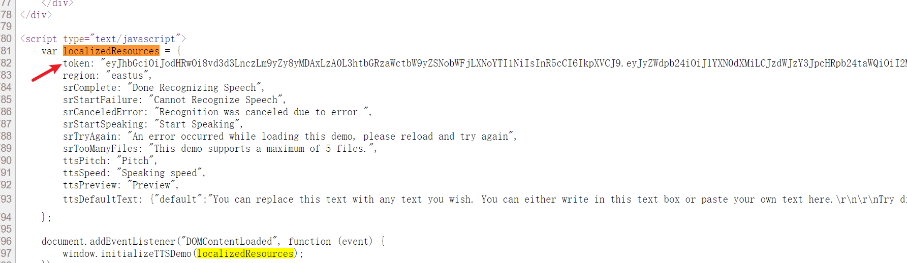
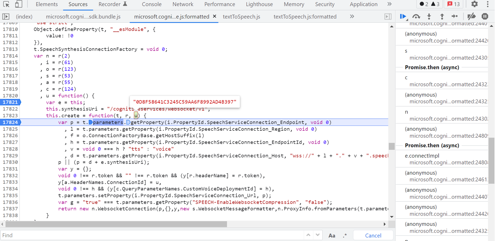
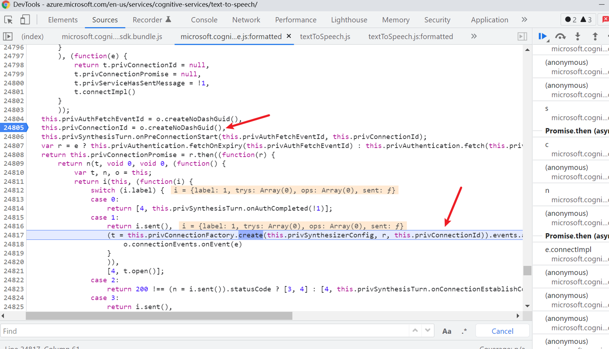
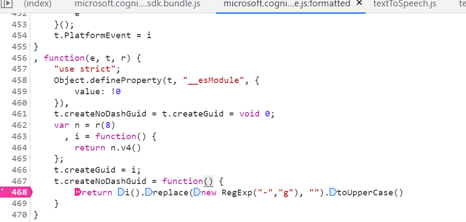
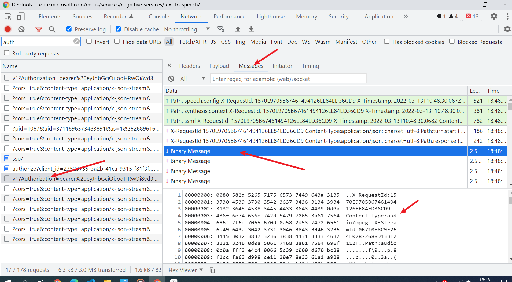

## 核心的请求是这个 `wss://eastus.tts.speech.microsoft.com/cognitiveservices/websocket/v1`
这个请求有两个参数`Authorization`和`X-ConnectionId`
其中`Authorization`来自网页源代码`token`，可以直接用正则取



`X-ConnectionId`稍微复杂一点，搜索 `cognitiveservices/websocket/v1`定位到如下位置，发现已经生成，往下追一步



发现是`createNoDashGuid`生成的



继续追发现是一个uuid4



python 模拟非常简单

```python
import uuid
print(uuid.uuid4().hex.upper())
```

## websocket部分

上述请求之后，改成websocket传递

客户端发送文本，服务端返回二进制

发送的内容示例

```
Path: speech.config
X-RequestId: 1570E9705B67461494126EE84ED36CD9
X-Timestamp: 2022-03-13T10:48:30.067Z
Content-Type: application/json

{"context":{"system":{"name":"SpeechSDK","version":"1.19.0","build":"JavaScript","lang":"JavaScript"},"os":{"platform":"Browser/Win32","name":"Mozilla/5.0 (Windows NT 10.0; Win64; x64) AppleWebKit/537.36 (KHTML, like Gecko) Chrome/99.0.4844.51 Safari/537.36","version":"5.0 (Windows NT 10.0; Win64; x64) AppleWebKit/537.36 (KHTML, like Gecko) Chrome/99.0.4844.51 Safari/537.36"}}}
```


```
Path: synthesis.context
X-RequestId: 1570E9705B67461494126EE84ED36CD9
X-Timestamp: 2022-03-13T10:48:30.068Z
Content-Type: application/json

{"synthesis":{"audio":{"metadataOptions":{"bookmarkEnabled":false,"sentenceBoundaryEnabled":false,"visemeEnabled":false,"wordBoundaryEnabled":false},"outputFormat":"audio-24khz-160kbitrate-mono-mp3"},"language":{"autoDetection":false}}}
```

第三个发送的包中包含需要转换的文本

```
Path: ssml
X-RequestId: 1570E9705B67461494126EE84ED36CD9
X-Timestamp: 2022-03-13T10:48:30.068Z
Content-Type: application/ssml+xml

<speak xmlns="http://www.w3.org/2001/10/synthesis" xmlns:mstts="http://www.w3.org/2001/mstts" xmlns:emo="http://www.w3.org/2009/10/emotionml" version="1.0" xml:lang="en-US"><voice name="en-US-JennyNeural"><prosody rate="0%" pitch="0%">You can replace this text with any text you wish. You can either write in this text box or paste your own text here.

Try different languages and voices. Change the speed and the pitch of the voice. You can even tweak the SSML (Speech Synthesis Markup Language) to control how the different sections of the text sound. Click on SSML above to give it a try!

Enjoy using Text to Speech!</prosody></voice></speak>
```


然后服务器返回一段二进制，只需要提取`Path:audio`后面的内容拼接就是我们需要的mp3文件。



