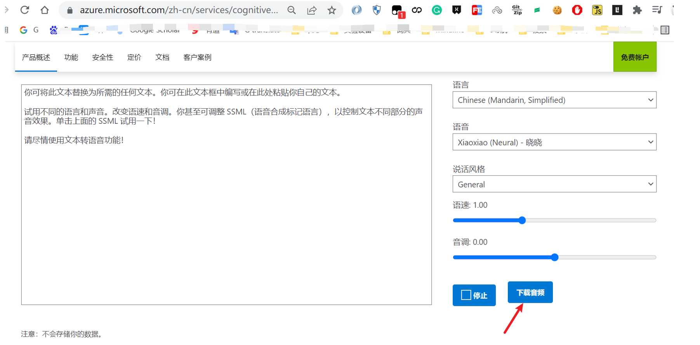

# 微软tts 下载音频按钮（tampermonkey脚本）
**脚本主页**

```
https://greasyfork.org/zh-CN/scripts/441531-%E5%BE%AE%E8%BD%AFtts-%E4%B8%8B%E8%BD%BD%E6%8C%89%E9%92%AE
```

**效果**



## 详细debugge 笔记
[debugge 笔记](./debugge_note.md)

## 笔记

1. tampermokey 尽可能早运行脚本`@run-at document-star`
2. 核心是hook `document.addEventListener` 重写 `window.initializeTTSDemo` 完成注入，这个可能不是最佳的注入点
3. `synthesizer.synthesisCompleted`运行时合成的声音已经传输完毕，当前作用域的`arguments[1].privResult.privAudioData`即为合成声音MP3的二进制数据
4. 通过以下方法下载二进制文件

```
function saveFile(name, type, data) {
    if (data !== null && navigator.msSaveBlob) {
        return navigator.msSaveBlob(new Blob([data], { type: type }), name);
    }
    var a = $("<a style='display: none;'/>");
    var url = window.URL.createObjectURL(new Blob([data], { type: type }));
    a.attr("href", url);
    a.attr("download", name);
    $("body").append(a);
    a[0].click();
    window.URL.revokeObjectURL(url);
    a.remove();
    window.xtw.playdlbut.innerHTML = "先点播放";
};
//debugger;
if (window.xtw.privAudioData) {
    saveFile(new Date().getTime(), "audio/mp3", window.xtw.privAudioData);
    window.xtw.privAudioData = null;
} else {
    alert('先点播放，等按钮变成下载音频再点击')
}
```

5. 导出到全局如`window.xtw` 以便使用
6. websocket的学习